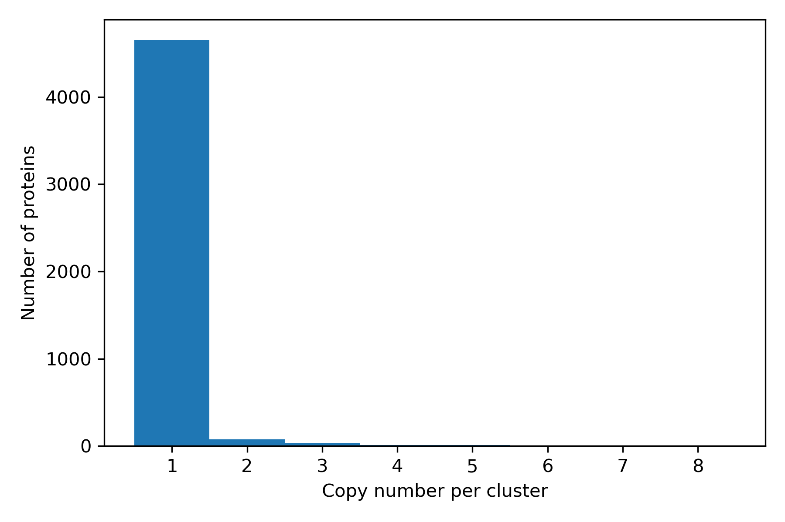
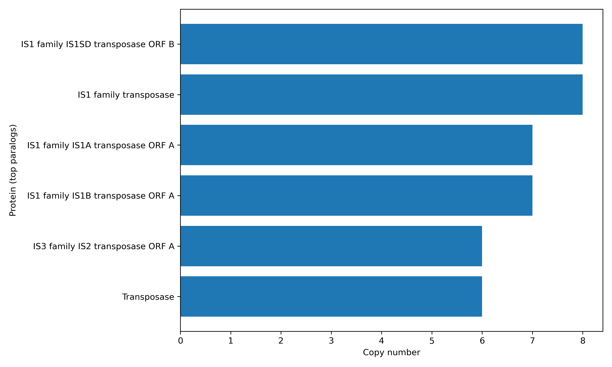

# Project 1: Genomics Pipeline 

In this project, you will build an end‑to‑end genomics pipeline to
identify paralogous protein‑coding genes starting directly from raw
Nanopore FASTQ files.

> *Finally, we are here.*

------------------------------------------------------------------------

## Resources

- [**Flye**](https://github.com/mikolmogorov/Flye)
- [**Bakta**](https://github.com/oschwengers/bakta)
- [**MMSeqs2**](https://github.com/soedinglab/MMseqs2)

------------------------------------------------------------------------

## Overview

Your lab wants to investigate the genomes of several new bacterial strains, focusing specifically on 
protein‑coding genes that appear in multiple copies (paralogs). You have extracted genomic
DNA and sequenced it using the Oxford Nanopore platform, obtaining long‑read FASTQ files.

For this project, you are provided with two raw fastq files:

-   **E. coli**:
    `/farmshare/home/classes/bios/270/data/project1/SRR33251869.fastq`
-   **K. pneumoniae**:
    `/farmshare/home/classes/bios/270/data/project1/SRR33251867.fastq`

The expected inputs and outputs of your pipeline are:
#### **Input**

-   Raw long‑read Nanopore FASTQ files

#### **Output**

For each input fastq file, output:
- A **TSV file** listing all proteins that occur more than once (paralogs), with three columns:  
  **`protein_id`**, **`protein_name`**, **`copy_number`**
- **Visualizations**: minimally, a **PNG** image with bar plot showing top 10 most frequent paralogs

------------------------------------------------------------------------

## Step 1:  Genome Assembly with Flye

Let say you do not have good reference genomes for these strains and also want to potentially discover novel
paralogs. Therefore, you will assemble their genomes de novo using **Flye**.

Container:

    /farmshare/home/classes/bios/270/envs/bioinformatics_latest.sif

Example command:

    flye --nano-raw SRR33251869.fastq --out-dir ecoli_flye_out --threads 32

The key output of this step is the assembled genome `assembly.fasta`, e.g.:

    /farmshare/home/classes/bios/270/data/project1/ecoli_flye_out/assembly.fasta

------------------------------------------------------------------------

## Step 2: Genome Annotation with Bakta

Use **Bakta** to predict and annotate genes.\
Container:

    /farmshare/home/classes/bios/270/envs/bakta_1.8.2--pyhdfd78af_0.sif

Example command:

    bakta --db /farmshare/home/classes/bios/270/data/archive/bakta_db/db --output ecoli_bakta_out/ ecoli_flye_out/assembly.fasta --force

The file you care about is the predicted protein FASTA (`.faa`), e.g.:

    /farmshare/home/classes/bios/270/data/project1/ecoli_bakta_out/assembly.faa

------------------------------------------------------------------------

## Step 3: Protein Clustering with MMseqs2

Cluster proteins to detect duplicated genes (paralogs).\
Example command:

    mmseqs easy-cluster ecoli_bakta_out/assembly.faa ecoli_prot90 tmp --min-seq-id 0.9 -c 0.8 --cov-mode 1 -s 7 --threads 32

Clustering output e.g. :

    /farmshare/home/classes/bios/270/data/project1/ecoli_mmseqs_out/ecoli_prot90_cluster.tsv

This file contains two columns:

- **Column 1** – `cluster_id` (the representative protein ID for the cluster)  
- **Column 2** – `protein_id`
------------------------------------------------------------------------

## Step 4: Summarize and Visualize the result

In this step, you will write a custom Python or R script that:

- Takes as input:
  - the protein FASTA file `assembly.faa` generated in **Step 2**, and  
  - the clustering result `*_cluster.tsv` generated in **Step 3**
- Parses the protein headers in `assembly.faa` to extract the **protein name** for each `protein_id`
- Uses `clusters.tsv` to:
  - identify clusters containing more than one protein (paralogs)  
  - compute the **copy number** for each protein (number of occurrences per cluster)
- Produces:
  - a **TSV summary file** with columns: `protein_id`, `protein_name`, `copy_number`  
  - one or more **visualizations** (e.g. bar plots) showing the most frequent paralogs and their copy numbers across the genome.

This is the code used for tsv summary file extraction and visualization:  
```python
import sys
import pandas as pd
import matplotlib.pyplot as plt
from pathlib import Path

def parse_fasta_headers(faa_path):
    id_to_name = {}
    with open(faa_path) as f:
        for line in f:
            if line.startswith(">"):
                header = line[1:].strip()
                parts = header.split(None, 1)
                prot_id = parts[0]
                prot_name = parts[1] if len(parts) > 1 else ""
                id_to_name[prot_id] = prot_name
    return id_to_name


def main(faa_path, cluster_tsv, out_prefix):
    prot_name_map = parse_fasta_headers(faa_path)

    df = pd.read_csv(
        cluster_tsv,
        sep="\t",
        header=None,
        names=["cluster_id", "protein_id"]
    )

    df = df.drop_duplicates(subset=["cluster_id", "protein_id"])

    cluster_sizes = df.groupby("cluster_id").size().rename("copy_number")
    df = df.join(cluster_sizes, on="cluster_id")

    df["protein_name"] = df["protein_id"].map(prot_name_map).fillna("")

    summary_cols = ["protein_id", "protein_name", "copy_number", "cluster_id"]
    summary = df[summary_cols].sort_values("copy_number", ascending=False)
    summary_tsv = f"{out_prefix}_paralog_summary.tsv"
    summary.to_csv(summary_tsv, sep="\t", index=False)
    print(f"Wrote summary table: {summary_tsv}")

    paralog_df = summary[summary["copy_number"] > 1]

    if not paralog_df.empty:
        top = paralog_df.head(20).copy()
        labels = top["protein_name"].replace("", pd.NA).fillna(top["protein_id"])

        plt.figure(figsize=(10, 6))
        plt.barh(labels, top["copy_number"])
        plt.xlabel("Copy number")
        plt.ylabel("Protein (top paralogs)")
        plt.gca().invert_yaxis()
        plt.tight_layout()
        out_png = f"{out_prefix}_top_paralogs.png"
        plt.savefig(out_png, dpi=300)
        plt.close()
        print(f"Wrote bar plot of top paralogs: {out_png}")

    plt.figure(figsize=(6, 4))
    summary["copy_number"].plot.hist(
        bins=range(1, summary["copy_number"].max() + 2),
        align="left"
    )
    plt.xlabel("Copy number per cluster")
    plt.ylabel("Number of proteins")
    plt.tight_layout()
    hist_png = f"{out_prefix}_copy_number_hist.png"
    plt.savefig(hist_png, dpi=300)
    plt.close()
    print(f"Wrote copy-number histogram: {hist_png}")

if __name__ == "__main__":
    if len(sys.argv) == 3:
        faa_path = sys.argv[1]
        cluster_tsv = sys.argv[2]
        p = Path(cluster_tsv)
        out_prefix = p.stem                      

    elif len(sys.argv) == 4:
        faa_path = sys.argv[1]
        cluster_tsv = sys.argv[2]
        out_prefix = Path(sys.argv[3]).stem

    else:
        print("Usage: python summarize_paralogs.py assembly.faa cluster.tsv [out_prefix]")
        sys.exit(1)

    print("FASTA path:", faa_path)
    print("Cluster path:", cluster_tsv)
    print("Out prefix:", out_prefix)

    main(faa_path, cluster_tsv, out_prefix)

```
|  |  |
|:------------------:|:------------------:|
| Ecoli Prot90 copy number histogram             | ecoli Prot90 cluster top paralogs             |


## Estimated Runtime and Resource (per FASTQ)

| Step | Tool        | Threads  | RAM (GB) | Wall Time (typical) |
|------|-------------|-------------------|----------|----------------------|
| 1    | Flye        | 16–32             | 32–64    | 1–2 hours      | 
| 2    | Bakta       | 8–16              | 8–16     | 20–40 minutes    | 
| 3    | MMseqs2     | 8–32              | 1–4     | < 5 minutes     | 
| 4    | Custom Script (Python/R) | 1–4 | 1–4 | < 5 minutes |

##  Reference Outputs

To assist with your project, expected outputs for each step are already
available:

    /farmshare/home/classes/bios/270/data/project1/

Example:

    /farmshare/home/classes/bios/270/data/project1/ecoli_flye_out

------------------------------------------------------------------------
